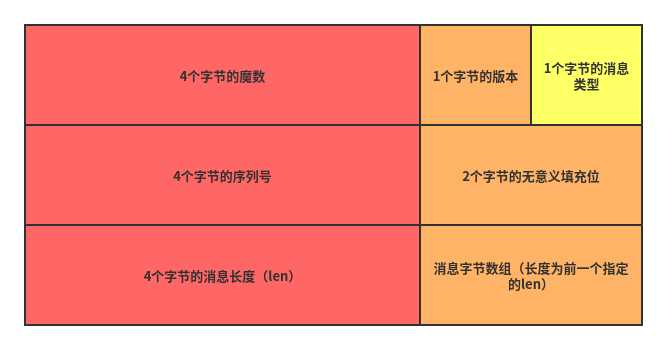

# vrpc

​		一款基于netty实现的用于Java的rpc框架，现支持创建客户端、服务端对象来进行远程过程调用，后续计划适配到[summer](https://github.com/vfdxvffd/Summer)（一个自己实现的类似Spring的Java框架）框架，利用注解更快的开发。项目持续维护中...欢迎Star！Thanks~~~

- [x] 基本的远程调用功能
- [x] 客户端
- [x] 服务端
- [ ] 适配到summer框架

## 运行环境

JDK 8

## 如何使用

​		下载最新release的jar包，将其导入项目中，即可使用。

## 项目梗概

​		通过在本地创建需要远程调用的接口的代理对象，当需要调用某个方法的时候客户端通过netty发送请求消息，在服务端执行后将执行结果通过netty发送响应消息。

### 制定特定的协议头部

​		一款rpc框架，底层通信采用netty框架，制定了通信协议如下图：4个字节的魔数标识协议；1个字节的版本表示当前的协议版本，方便后面扩展；1个字节的消息类型，指定此消息的类型，请求消息或是响应消息；4个字节的序列号，服务端可能同时收到多个客户端的请求，根据序列号将结果正确地返回给客户端；2个字节的填充位无意义；4个字节的消息长度，表示了后面真正的消息的长度；然后根据前面消息长度来接受后面的消息。

### 消息的序列化方式

​		客户端与服务端的通信交流采用多种序列化方式，目前内置了四种序列化方式：`JDK的序列化`、`gson`、`fastjson`、`jackson`，默认采用`fastjson`，可以通过在构造客户端/服务端对象的时候指定具体的序列化方式。

​		支持传入自定义的序列化方式，通过实现`com.vfd.protocol.serializer`包下的`Serializer`接口即可创建一个自定义的序列化器，传入客户端/服务端构造函数即可。

### 连接的管理

​		连接并不是获取对象的时候就建立的，获取的对象并非真正远程的对象，而是在本地创建的代理对象，只有真正调用方法的时候才会去建立连接和服务端通信。

​		在服务端开启服务提供功能后，netty的`bossGroup`将一直监听端口处理连接，连接建立后交给`workerGroup`来处理具体请求，当需要关闭服务端的服务时，需要`显式地调用服务端的关闭函数`即可关闭服务端。

​		在客户端创建客户端对象的时候可以指定连接为`长连接`or`短连接`，通过传入构造函数中`closeConnect`参数值指定长/短连接，`true`为短连接，即每次调用后关闭连接，`false`为长连接，每次调用后不关闭，需要显式关闭，如不指定则默认为短连接。

- 如果是长连接则一直保持连接客户端和服务端连接的开启直到显示调用函数关闭连接，这样做的好处在于不用每次调用远程的方法时建立一次连接，效率更高，但需要一直保持着连接，在没有远程调用的时候是一个对资源的浪费。
- 如果是短连接则会在一次调用后断开连接，当下次连接发起的时候又会重新建立连接。这样做的好处是不用一直维护着连接，但是频繁的调用需要重复建立连接和断开连接的操作，效率就会有点低。

​		综合考虑以上两种连接方式，如果是在一小段时间需要多次调用远程调用，我们可以考虑使用长连接，使用结束后手动关闭连接，如果只是使用一次，则建议使用短连接，这样可以省去关闭的操作（vrpc内部自动关闭）。

## Version 0.1(Pre-Release)

1. 搭建基本的框架
2. 支持基本的远程调用（通过接口调用远程的具体实现方法）
3. 实现客户端的具体操作的封装
4. 实现服务端的具体操作的封装
5. 内置支持多种序列化方式，支持自定义序列化
6. 客户端到服务端的连接支持长连接or短连接的选择